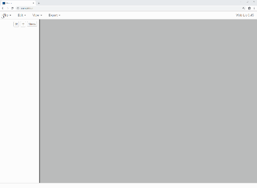

# Web Lic

Web Lic is a browser based application for creating and editing LEGO instruction books. Lic imports 3D LDraw models, organizes them into submodels, pages & steps, and gives you full WYSIWYG edit option.  Complete instruction books can be exported as images or PDF at any resolution.

[Try Web Lic out here](http://bugeyedmonkeys.com/lic/)

##### Highlights

- A rich, WYSIWYG UI editor that provides a fully interactive preview window along side a simple navigation tree, to help organize and layout your instructions.
- Automatically divide your model into steps. Add a list of parts needed for each step, and auto-layout multiple steps per page for a best fit. Auto-generate a title page and part list pages.
- Full control over every color, border and font of your instruction book.  Save your custom styling as a template and use that template for future books.
- Easily create common LEGO instruction book features, like callouts, rotated steps, displaced parts, and steps that span multiple pages.
- Completed instruction books can be exported as either a collection of PNG images or as a PDF. You can choose any resolution during export, like low resolutions suitable for the web, or very high resolutions suitable for printing.

Lic assumes you have already created a LEGO model in the LDraw file format. All of the popular LEGO model building tools are able to create LDraw models, either directly or as an 'Export As LDraw' option.

Lic is currently in an early beta stage. It is stable and ready for regular use. The core engine and UI elements are complete; all that's left to do is add more features. Any save files you create now will continue to work in all future versions of Lic.

Lic is intended to be a complete replacement for the aging and no longer maintained desktop version of [Lic](https://github.com/remig/lic).  This time around, it's architected in a much more simple and maintainable way.  And it has unit tests.

Lic is built using [Vue.js](https://vuejs.org/).  Models and parts are rendered with WebGL.  This is a purely client side application; there is no server side anything - beyond a web server to serve the initial content, of course.

Lic is totally free and open source.  You are welcome to use Lic for any project, for-profit or otherwise.  If you have any questions, find any bugs, or need any features, please open an [issue on GitHub](https://github.com/remig/web_lic/issues), or [email me](mailto:lic@bugeyedmonkeys.com). Your feedback is the main force driving Lic forward!

For more information see [the Wiki](https://github.com/remig/web_lic/wiki), which covers [running Lic locally](https://github.com/remig/web_lic/wiki/Running-Lic-Locally) and [translating Lic](https://github.com/remig/web_lic/wiki/Translating-Lic).

[LEGO®](http://lego.com/) is a registered trademark of the LEGO Group, which does not sponsor, endorse, or authorize this software project.

